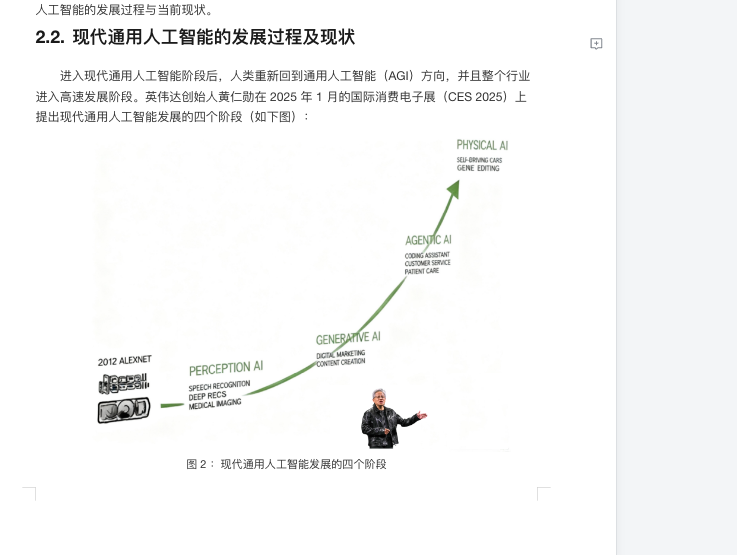

# 1.引言
## 1.1.编写本白皮书的目的
生成式 AI 是过去五年在信息技术领域最为关键的技术突破。随着 OpenAI 的 ChatGPT 火爆出圈， 大语言模型（Large Language Model，LLM）快速得到行业认可，人工智能也迎来了全新的发展阶段。尤其是过去两年，随着大语言模型的持续迭代升级，大语言模型已经初步具备像人一样理解问题、思考问题乃至采取行动的能力。于是企业开始非常关注如何利用生成式 AI 带来的技术红利，优化企业运营效率，扩大企业运营边界。
与此同时，面对生成式 AI 带来的技术冲击，大量企业对于如何理解和采纳这个技术有着种种困惑。这种困惑随着 DeepSeek R1 开源模型在 2025 年初发布后到达了巅峰。因为企业发现获得高质量大语言模型的门槛大幅度降低，而能否用好生成式 AI 技术成为企业 AI 转型的关键。于是，我们能看到国内大量企业在 DeepSeek R1 发布后都投入到企业 AI 转型的研究、规划和落地中。在企业纷纷投身到企业 AI 转型的同时，AI 产业界也立刻行动起来并在 2025 年上半年快速达成一个非常重要的行业共识，即企业落地生成式 AI 能力的主要产品形态是智能体。为此，智能体概念迅速走红，成为大量实践 AI 转型企业的核心实践对象。
经过半年的行业实践，大家能看到智能体在各行各业落地的很多成功案例。同时，也有大量企业在智能体初步实践过程中并没有取得预期效果，甚至产生对于智能体的质疑。为此，MaxKB 开源项目组希望借助本白皮书与业界同仁一块探讨企业内落地智能体的一些思考，阐述我们实践企业落地智能体方法与路径。我们希望借此能与大家共同推动智能体在企业内的生根发芽，并持续释放 AI 生产力。最终让我们都能实现 “让企业运行在智能体之上” 这样一美好愿景。
## 1.2.如何组织、发布和维护本白皮书
本白皮书由 MaxKB 开源项目组编写而成，编写团队从企业实践和技术演进的双重角度出发，结合自身在企业内落地智能体的长期研发与实践经验，同时积极听取行业内专家的意见和建议，在此基础上完成本白皮书。
本白皮书第一版于2025年第四季度发布，采取线上渠道（网站、微信公众号等）为主的分发模式。编写组会在发布后积极听取各位读者与行业专家的反馈与意见，持续校对与更新本白皮书的内容。更新后的白皮书仍然会以线上渠道为主分发给行业内的各位同仁与感兴趣的读者。欢迎各位积极给我们提供反馈与建议。

## 1.3.本白皮书给企业带来的价值
本白皮书面向企业 AI 转型负责人、AI 落地推动者、AI 落地专家以及企业高级管理人员。希望通过本白皮书能够让读者更好地理解现代人工智能的技术内涵、对企业的影响，以及企业应该如何面对这些变化。与此同时，本白皮书还会给各位带来 MaxKB 开源项目组在企业内落地智能体的一些实践方法论，让读者可以获得更多实操层面的参考。当然，企业内落地智能体涉及到方方面面的大量细节，这些肯定无法在一本简短的白皮书内详尽。期待白皮书能够抛砖引玉，引发大家更加全面和深入的思考。

