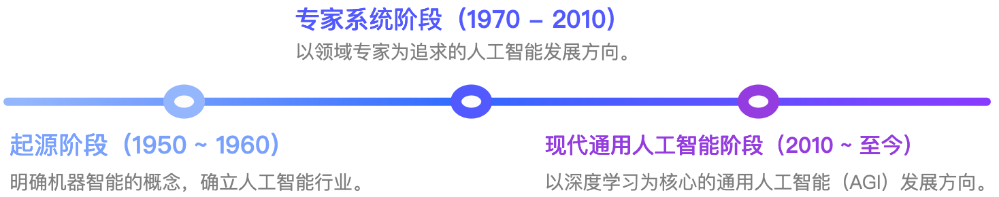
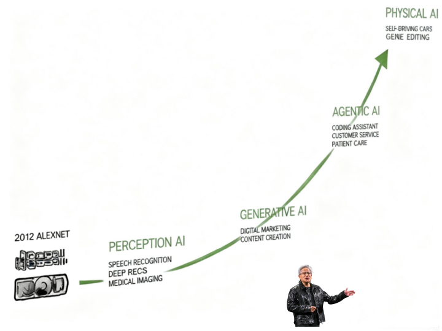

# 2.生成式 AI 的发展浪潮与智能体的兴起

作为和信息技术产业同步发展起来的一个重要领域，人工智能（Artifact Intelligence，AI）在20世纪中期就被明确提出来。早在1950年，人工智能之父艾伦·图灵就首次提出“机器智能”的概念，并同步提出一个大家耳熟能详的人工智能测试框架，即图灵测试。虽然人工智能的概念很早就被提出，但是人工智能的发展却一直不如人意，中间经历了多次起起落落，直到 2010 年随着生成式 AI 技术的成熟才得以进入大众视野。为了更好理解当前人工智能技术发展的现状，我们有必要完整回顾一下人工智能的整个发展历程。

## 2.1.AI 行业的发展历程回顾
人工智能的发展大体上可以分成三个发展阶段，即起源阶段，专家系统阶段与现代通用人工智能阶段。具体时间范围如下图所示：

图 1：人工智能的三个发展阶段 

从上图可以看出，人工智能发展历经 70 年，可以划分成三个阶段：
- 起源阶段（1950 ~ 1960）：随着人工智能之父艾伦·图灵在 1950 年提出机器智能的概念，人工智能的起源阶段正式开始。当时，学术界对于这一领域表现出极大的兴趣并快速形成了包括符合主义、连接主义和行为主义这三个主要研究方向。其中主要的研究学者在 1956年 6 月的达特茅斯会议上正式将机器智能定义为“人工智能”。在这个阶段，大家都对人工智能的发展抱有非常乐观的看法并认为人工智能会像信息技术产业一样很快就落地成真实生产力。
- 专家系统阶段（1970 ~ 2010）：在走过起源阶段后，大家很快就发现实现人工智能（尤其是通用人工智能）极其困难。人工智能很快就进入了一个发展低潮期，甚至出现对通用人工智能可否实现的怀疑。进入上个世纪 70 年代，大家开始放弃追求通用人工智能，转而期待能够构建领域专家系统来解决特定领域的复杂问题。在这个阶段，符号主义受到广泛关注并取得长足发展。其中最为标志性的事件就是IBM 深蓝系统战胜国际象棋大师。不过很快大家就发现专家系统能够落地应用的领域很窄、构建门槛高且不能扩展，并不能形成真正有效的生产力。即使 IBM 在深蓝之后重金打造的 “沃森”系统也没有逃脱这个命运。
- 现代通用人工智能阶段（2010 ~ 至今）：进入 21 世纪，尤其是 2012 年 AlexNet 系统在 ImageNet 比赛中取得压倒性优势之后，连接主义与基于神经网络的深度学习开始重新引起大家关注。由于其在图片识别这个领域快速超越人类，深度学习方向很快证明了自己的价值。随后，Transformer 架构解决了神经学习的规模化工程难题，OpenAI 的 GPT 模型应运而生，并通过 ChatGPT 应用火爆全网。通用人工智能（AGI）和超级人工智能（ASI）再度成为人类期望的人工智能发展方向。

毫无疑问，我们当前就处在通用人工智能技术快速爆发和迅速落地的变革阶段。用“日新月异”来描述这个领域当下的进步速度毫不夸张。正因为如此，我们值得更仔细地探讨一下现代通用人工智能的发展过程与当前现状。

## 2.2.现代通用人工智能的发展过程及现状
进入现代通用人工智能阶段后，人类重新回到通用人工智能（AGI）方向，并且整个行业进入高速发展阶段。英伟达创始人黄仁勋在 2025 年 1 月的国际消费电子展（CES 2025）上提出现代通用人工智能发展的四个阶段（如下图）：

图 2 ：现代通用人工智能发展的四个阶段

在黄仁勋眼里，现代通用人工智能发展经历感知 AI、生成 AI、代理 AI 与物理 AI 四个阶段。具体来说，它们分别指：
- 感知 AI （ Perception AI：2012 ~ 2022）：利用深度学习技术，把数据、算法和算力融合到一块解决人工智能对于物理世界的感知问题，比如人脸识别、声音识别等。这个阶段也是大家认为的现代 AI 1.0 阶段。在这个阶段国内诞生了 AI 四小龙等创新性企业，并推动智能安防、智能身份识别等领域快速走向成熟。虽然这个阶段的人工智能已经广泛应用了深度学习技术，但是产生的模型仍然是领域模型为主且普遍缺乏泛化能力，导致不同领域的模型仍然被限制在特定领域，并未产生通用人工智能模型。
- 生成 AI （ Generative AI：2022 ~ 2024）：在 OpenAI 把深度学习应用于大语言模型领域训练并利用 Transformer 架构大幅度提高训练效率和规模后，通用大语言模型（GPT） 诞生了。由于语言自身的泛化能力， OpenAI 的 GPT 一开始就具备通用人工智能的特征。它可以理解文字输入并生成高质量答案。在这个阶段，大家使用到的 AI 应用主要是智能聊天机器人（Chatbot），最终用户通过与智能聊天机器人对话获得问题答案。基于 OpenAI 摸索出来的一整套大语言模型训练方法，行业快速训练出各种大编程语言模型、大图片生成模型、大视频生成模型，以及当前最火的多模态生成模型。业内一般统称这种通过大数据量训练出来的超大规模模型为“大模型（Large Model）”。有了各种大模型的加持，智能问答机器人除了生成文本，还能生成图片、语音乃至完整的视频片段。生成  AI 被认为现代通用人工智能的起航点，各种大模型带领行业向通用人工智能的目标走去。
- 代理 AI （ Agentic AI ：2024 ~ 现在）：生成 AI 阶段的各种模型仅局限于内容生成，不能采取行动（一种更形象地说法是“只会说不会做”）。行业希望大模型不仅仅要能理解、思考和决策，还希望它们能够采取行动并基于行动结果进行反思和迭代，最终能够“代理人类在数字世界去完成具体任务”。于是，行业很快进入代理 AI （Agentic AI）阶段。在这个阶段，以完成具体任务为目标的 AI 应用被定义成为 “智能体（Agent）”。它不仅仅拥有大模型的生成能力，还极大地提升了自身的推理能力和行动能力。另外，它还能理解与当前任务相关的企业内部知识、工具，以及工作过程中产生的记忆，能按用户给定的任务要求进行自主规划、执行和反思迭代。进入代理 AI 阶段后，通用人工智能首次迎来大规模在企业落地、释放生产力的契机。鉴于其中蕴含的巨大商业机遇，行业内相关技术在过去两年快速迭代、日趋成熟。
- 物理 AI （ Physical AI：现在 ~ 未来）：相比较代理 AI 主要是在数字世界帮助人类完成任务，物理 AI 期待大模型能够在物理世界帮助人类完成更多的任务。而物理 AI 发展的关键在于大模型对于物理世界的感知和物理规律的理解。为此行业开始广泛展开世界模型（World Model）的研究。毫无疑问，这是通用人工智能未来发展的重要方向，也是黄仁勋本人非常看重的发展方向。其中，此阶段最具代表性的产品形态是具身智能/机器人。
通过以上分析，不难看出当下正是代理 AI 快速进步和广泛落地的关键时刻。而智能体作为这个阶段最核心的产品形态，也就成为所有做 AI 转型的企业最为关键的研究对象和落地载体。为此，很多时候行业也把当下的代理 AI 时代称之为智能体时代。

## 2.3.智能体与智能体时代
如前文所述，智能体时代的主要产品形态是智能体。那何为智能体？这里让我们借用OpenAI 在2025年中发布的《关于构建智能体的实践指导》一文中的相关定义：

    智能体就是那些能够代表你去独立完成任务的系统。
	(Agents are systems that independently accomplish tasks on your behalf.)**

从上面定义可以看出，相比较生成式 AI 阶段的各种聊天机器人，智能体已经有了非常大的不同。具体来说：
- 首先，它需要去完成一个具体任务，也就是说一个智能体一旦启动就是为了一个清晰的任务目标而去。而聊天机器人的每次启动仅仅是为回答当前这轮问题，对问题背后用户的任务及目标一无所知。
- 其次，它需要尽可能独立地完成整个任务，这其中涉及到完成任务需要的任务规划，调用工具执行，对执行结果的评估以及自主迭代。而聊天机器人则对此并无涉及，它永远扮演着一个被动响应用户问题的角色，在输出问题答案后即结束本轮服务，并且不对这个答案的结果做任何自我评估，也不会按答案结果去调用工具并执行相关任务。
如上所述，智能体天生就是为了接受人类委托并去自主完成任务的。为此，进入智能体时代，各种大模型为了更好满足智能体的需求，纷纷增强推理、工具调用等能力，并诞生了如 Model Context Protocol（MCP）这样的行业开放协议来提升协作效率。有了这些技术的进步，智能体落地的条件也逐步成熟。一旦智能体能在企业内大规模落地，那就形成除人类员工之外的企业经营生产力，也就是大家日常说的“硅基员工”。所以，智能体时代企业落地人工智能生产力的核心抓手也自然就是：

	构建一组能够产生数字生产力的智能体
